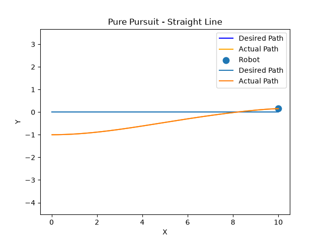
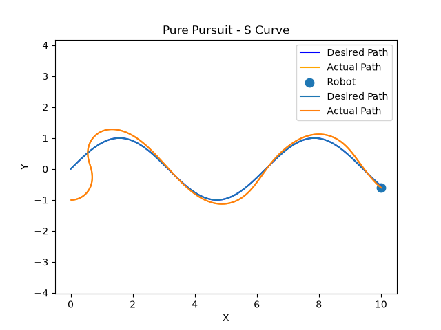
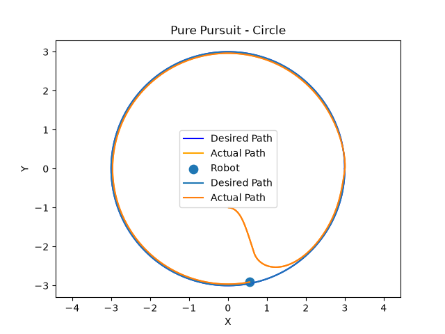
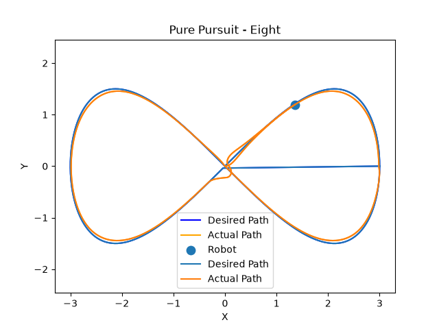

# Pure Pursuit Path Tracking Simulation

A Python-based simulation of the Pure Pursuit path-tracking algorithm for a differential-drive-style robot model.

This project was developed as part of my robotics learning through CEAM and focuses on understanding how a robot can follow predefined trajectories using geometric path tracking.

## Overview

Pure Pursuit is a path-tracking algorithm that determines a target point ahead of the robot and calculates the curvature required to steer toward that point.

The simulation:

1. Generates a reference trajectory.
2. Finds the point on the trajectory closest to the robot.
3. Selects a lookahead target.
4. Calculates the heading error between the robot and target.
5. Calculates the required curvature.
6. Updates the robot's position and orientation.
7. Compares the desired path with the robot's actual trajectory.

## Core Algorithm

The controller uses the Pure Pursuit curvature relationship:

$$
\kappa = \frac{2\sin(\alpha)}{L_d}
$$

where:

- $\kappa$ = required path curvature
- $\alpha$ = angle between the robot heading and the lookahead target
- $L_d$ = lookahead distance

The robot state is then updated using its velocity and angular velocity.

## Trajectory Tests

The controller was tested on four different predefined trajectories:

### 1. Straight Line

Tests basic path tracking and convergence toward a linear reference path.



### 2. S-Curve

Tests tracking on a continuously changing curved trajectory.



### 3. Circle

Tests the controller's ability to follow a continuously curved path.



### 4. Figure-8

Tests tracking on a more complex trajectory with changing curvature.



## Technologies Used

- Python
- NumPy
- Matplotlib
- Pure Pursuit path-tracking algorithm
- Numerical simulation
- Trajectory generation

## Project Structure

```text
Pure Pursuit/
│
├── pure_pursuit.py
├── straight_line.py
├── s_curve.py
├── circle.py
├── figure8.py
│
├── screenshots/
│   ├── straight_line_correct.png
│   ├── S.png
│   ├── circle.png
│   └── eight.png
│
└── README.md
```

## Running the Simulation

Install the required Python libraries:

```bash
python3 -m pip install numpy matplotlib
```

Run any of the trajectory simulations:

```bash
python3 straight_line.py
```

or:

```bash
python3 s_curve.py
python3 circle.py
python3 figure8.py
```

## What I Learned

Through this project, I explored:

- The fundamentals of path tracking
- Lookahead-based control
- Heading error calculation
- Curvature-based steering
- Trajectory generation
- Numerical simulation of robot motion
- The effect of different trajectories and controller parameters

## Future Improvements

Planned improvements include:

- Integrating the controller with ROS2
- Testing the controller in a robot simulator such as Gazebo
- Adding a PID-based velocity controller
- Using sensor or localization data instead of predefined robot state
- Improving trajectory handling and target-point selection
- Testing the controller on a physical mobile robot

## Author

**Suri**

Second-year Robotics and AI student interested in autonomous systems, robotics, embedded systems, and control.